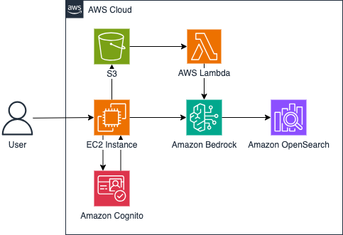

# 1. Project objectives:
Build a secure, maintainable and context-aware chatbot that helps authorized users quickly retrieve information about company members.

# 2. Product overview:
- Markdown File Upload. Users can upload Markdown files containing key information about employees, teams, and projects.
- Automatic synchronization. Process that updates the chatbot’s knowledge base whenever a new file is uploaded.
- Conversational Memory. The chatbot retains short-term memory of the conversation within a session.
- Authentication & Security. It manages sign-in and ensures that only verified and authorized users can upload or retrieve information.
- Telegram Group Notification. Immediately forwards the Q&A to a Telegram group

# 3. Architecture:

User → signs in with Cognito.

User → uploads file via EC2 web app → file goes to S3 → triggers Lambda → calls Bedrock (Embeddings) → updates OpenSearch.

User → enters query → EC2 calls Bedrock (Embeddings + Text) with support from OpenSearch → final answer returned to user.

# 4. Detailed components:
- Amazon Cognito: Provides secure authentication and authorization for the user before any actions (upload/query).
- Amazon S3 + AWS Lambda: Automates ingestion—new or modified files in S3 trigger Lambda to embed them and update OpenSearch.
- Amazon Bedrock: Titan Embeddings for vectorizing text (both documents and queries). Titan Text  for generating final answers.
- Amazon OpenSearch: Holds the vector index, enabling semantic search and retrieval of relevant data.
- Amazon EC2: Runs the main web application (Flask framework) that orchestrates user interaction, calls Bedrock, and displays answers.

# 5. Deployment steps:
1. Configure S3. Create a bucket for Markdown uploads. Enable triggers for AWS Lambda on object creation.
2. Setup Amazon Cognito. Create a user pool, client app, and integrate with the Flask application. 
3. Deploy EC2 & Flask. Implement routes for upload and chat. 
4. Create AWS Lambda. Subscribed to S3 events and create logic for automatic synchronization with knowledge base.
5. Configure Amazon Bedrock. Create knowledge base with Titan Embeddings, Titan Text (Premier) models and OpenSearch as vector store.
6. Telegram Integration. Create a Telegram Bot via BotFather. Add the bot to the desired group. Integrate to Flask application.
7. Testing. Upload a sample Markdown file. Query the chatbot and confirm it returns correct answers. Check the Telegram group for the posted message.
